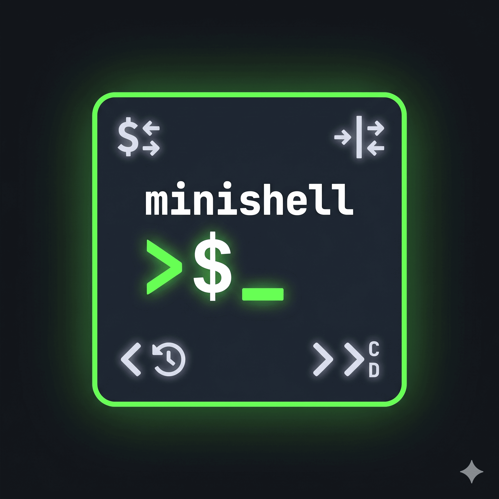

<div align="center">
  <a href="https://github.com/yusa-bot/minishell_v2/blob/master/docs/icon.png">
    
  </a>
  <h1>
    <b>minishell</b>
  </h1>
</div>

*This project has been created as part of the 42 curriculum by ayusa, fnakamur*

> **Note:** このリポジトリは、課題として提出した成果物単体ではなく、**開発過程で書かれた設計メモ・試行コード・レビューログ・pre-review ツールまでを含む「開発プロセス込み」のリポジトリ**である。提出用のクリーンな実装だけを見たい場合は [submit-real/](submit-real/) 配下を参照。

### Pre Research
wrote: [minishellのための知識](https://zenn.dev/ayusa/articles/22a73b6875639b)

## Table of Contents

1. [Repository Layout](#repository-layout)
2. [Description](#description)
   - [Supported features](#supported-features)
   - [implemented Built-in commands](#implemented-built-in-commands)
3. [Instructions](#instructions)
4. [Development logs & project explanation](#development-logs--project-explanation)
   - [working/](#working)
   - [algorithm memo](#algorithm-memo)
   - [test](#test)
     - [tester](#tester)
     - [valgrind](#valgrind)
   - [Agentic Review (pre-review pipeline)](#agentic-review-pre-review-pipeline)
5. [Git / GitHub 運用](#git--github-運用)
6. [Resources](#resources)
   - [reference](#reference)
   - [AI Usage](#ai-usage)

# Repository Layout

ルート直下の主なディレクトリは以下の通り。

| Path | 内容 |
|------|------|
| [working/](working/) | 動作させるための初期実装コード |
| [submit/](submit/) | working/ を基に、コード規約`norm`を遵守するため、コメントアウトの排除や関数分けに対応したver. |
| [submit-real/](submit-real/) | 実際に提出するファイルのみを含んだsub module |
| [agentic-review/](agentic-review/) | Gemini CLI を用いた`fnakamur`自作の pre-review パイプライン |
| [docs/](docs/) | 管理用メモ等 |
| [scripts/](scripts/) | 補助スクリプト |

# Description

Unix シェルの中核的な bash 挙動を再現する、C 言語による最小限の実装である。

このシェルは `readline` を介して対話的にユーザー入力を読み取り、抽象構文木 (AST) に解析した上で、パイプ・リダイレクト・環境変数・シグナルを適切に扱いながらコマンドを実行する。<br>
パイプラインは **Lexer → Parser → Expander → Executor** の 4 段階で構成されている。

### Supported features
- Pipes (`|`) and pipelines
- Input/output redirections (`<`, `>`, `>>`, `<>`)
- Heredoc (`<<`) with variable expansion
- Logical operators (`&&`, `||`) with correct precedence
- Subshells via parentheses (`(...)`)
- Variable expansion (`$VAR`, `$?`)
- Wildcard expansion (`*`) in the current directory
- Single quotes and double quotes
- Command history (arrow keys)
- Signal handling: `Ctrl+C` (SIGINT), `Ctrl+D` (EOF), `Ctrl+\` (SIGQUIT)

### implemented Built-in commands
| Command | Description |
|---------|-------------|
| `echo [-n]` | 引数を標準出力に出力 |
| `cd [dir]` | カレントディレクトリを変更 |
| `pwd` | カレントディレクトリを表示 |
| `export [name[=value]]` | エクスポート環境変数を設定または表示 |
| `unset [name]` | 環境変数を削除 |
| `env` | すべての環境変数を表示 |
| `exit [n]` | ステータス `n` でシェルを終了 |

## Instructions

**Requirements**

- GCC or Clang
- GNU Readline library (`libreadline-dev` on Debian/Ubuntu)
- `make`

**Compilation**
```
make
```

**Execution**
```
./minishell
```

The shell launches with the prompt `何か打ち込んでみろッ！`.
(feat.モモンガ@ナガノ)

**Usage examples**
```sh
何か打ち込んでみろッ echo "Hello, world!"
何か打ち込んでみろッ ls -la | grep ".c" | wc -l
何か打ち込んでみろッ cat < infile.txt > outfile.txt
何か打ち込んでみろッ mkdir /tmp/testdir && echo "created"
何か打ち込んでみろッ cat nonexistent.txt || echo "file not found"
何か打ち込んでみろッ false || true && echo "success"
何か打ち込んでみろッ export FOO=bar && echo $FOO
何か打ち込んでみろッ (echo hello; echo world) | cat
何か打ち込んでみろッ cat << EOF
ウラ> line1
ウラ> EOF
何か打ち込んでみろッ echo $?
```

**Cleanup**
```
make fclean
```

# Development logs & project explanation

## working/
[working/file_architecture](working/file_architecture)に初期コードの関数architectureを明記。<br>
プロトタイプ宣言をtree表示で管理することで全体を把握。

## algorithm memo

### AST
```
<全体の流れ>
parse_list()
↓ 呼ぶ  ↑ 戻って処理
parse_pipeline()
↓ 呼ぶ  ↑ 戻って処理
parse_command()
   [単一コマンドに進む or subshellで再帰] に分岐
      subshellの時: parse_listから再帰
      NODE_CMDの時だけ、木の葉だから、先にnodeを作る
         NODE_CMD: ここでparse_redirect
            TK_HEREDOC: redir->quoted = 1 (デリミタ)

1. left(コードだとnode)作る
2. *tokens = (*tokens)->next; で classify token 飛ばす
3. right作る
4. node = new_node(type, node, right);
```

### heredoc
parser時のredir->quotedの有無でデリミタのexpandするかを決定<br>
redir->filename = tmp_filename; で通常のredirectのようにexecできる


### pipe

```
pipeは2つを子プロセスで実行 かつ fdを繋ぐ という2つの手法が入り組んでいる

pipe(fd):
    fd[0]:書(左), fd[1]:読(右) のプロセスを繋げる

fork(): pids[0](左)の子プロセス で fd[1] を書き込みにする -> |の左のコマンド exec_ast(node->left, env_list) を実行
fork(): pids[1](右)の子プロセス で fd[0] を読み込みにする -> |の右のコマンド exec_ast(node->right, env_list) を実行
```

### その他

`working/---project---/` 配下に機能ごとの実装前メモを置き、理解を促進。

- [ワイルドカードのexpand仕様](working/---project---/src/expander/_expand.c)
- [t_node構造体へのparse格納仕様](working/---project---/src/parser/_ex_parser.c)
- [signalの仕様](working/---project---/src/signal/_signal.c)

## test

### tester
42生が自作したtesterを利用。

[42_minishell_tester](https://github.com/nafuka11/42_minishell_tester.git)<br>
[minishell_test](https://github.com/M2U7BF/minishell_test.git)<br>
[minishell_tester](https://github.com/LucasKuhn/minishell_tester.git)

### valgrind

メモリリークの検出に使用。<br>
readline内部のリークは免責されるため、[docs/minishell.supp](docs/minishell.supp)で、readlineのリークを除外。


## Agentic Review (pre-review pipeline)

提出前の品質を底上げするために、[agentic-review/](agentic-review/) というサブモジュール化した **`fnakamur`自作の pre-review パイプライン** を繰り返し回して開発を進めた。<br>
42 のpeer evaluationを受ける前に、LLM エージェントに同等以上の厳しさで一次レビューをさせ、peer evaluationの品質を向上する目的もある。<br>
(42では、課題のクリアを生徒同士のpeer evaluationのみで審査している。)

課題PDF等を仕様源として Gemini CLI に「Aggressive Reviewer」ペルソナで静的監査・破壊的テスト・説明要求リスト生成までを自動実行し、Markdown レポートとして蓄積する。<br>


## Git / GitHub 運用

- **GitHub**: testやAgentic Reviewで見つかった問題点をissueで管理し、優先度をlabelで表現することで対応是非を決定。
- **Git submodule**: 他課題で共通に利用するリポジトリを分離。


## Resources

### reference
- [低レイヤを知りたい人のためのCコンパイラ作成入門](https://www.sigbus.info/compilerbook#%E7%94%9F%E6%88%90%E8%A6%8F%E5%89%87%E3%81%AB%E3%82%88%E3%82%8B%E6%96%87%E6%B3%95%E3%81%AE%E5%AE%9A%E7%BE%A9)

- [minishellで学んだこと](https://zenn.dev/khanadat/articles/79b570722a65f4)

- [JUNのブログ](https://jun-networks.hatenablog.com/entry/2021/07/02/034002)

### AI Usage

このプロジェクトでは、以下の用途で AI (Claude Code, Gemini) を利用した:

#### 実装前
- Claude Codeで使用許可関数一覧のmanを叩き、関数の仕様理解
- 各使用許可関数のインターフェースを把握する目的で、[サンプルコード](https://github.com/yusa-bot/minishell_v2/blob/master/working/sample_code.c)を生成

- 課題で要求される機能を理解するために、多種多様なシェルプロンプトを生成

#### test
- シェルの各機能 (リダイレクト、ヒアドキュメント、ワイルドカード、サブシェル) が正しく動作することを検証するため、多様なテストケースやエッジケースのプロンプトを生成 ([log](https://github.com/yusa-bot/minishell_v2/blob/master/docs/claude_log.txt))

- Norminette準拠のレビュー: リファクタリング時に関数の長さ、変数の数、フォーマットのルールが守られているかを確認

- 本README.mdの作成援助
